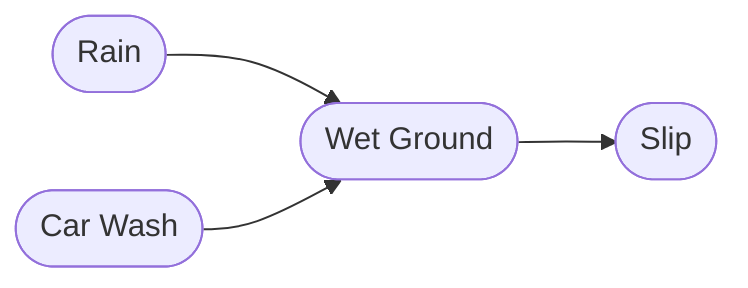

# Bayesian Networks: Structure and Function

## Definition

A **Bayesian Network (BN)** is a probabilistic graphical model that represents a set of variables and their conditional dependencies using a **Directed Acyclic Graph (DAG)**. It provides a structured way to encode probability distributions, enabling efficient inference and decision-making.

### Example Representation

Consider a simple Bayesian network modeling the probability of winning the lottery ($L$), the occurrence of rain ($R$), and the ground being wet ($W$):

The corresponding joint probability distribution is: 
$P(L,R,W)=P(L)P(R)P(W|R)$
Here:
- $P(L)$ and $P(R)$ are independent since they have no incoming edges.
- $P(W)$ is conditional on $R$, as indicated by the directed edge.

## Chains in Bayesian Networks

When variables form a sequential dependency chain, the probability distribution can be factored accordingly. Consider the updated structure:

The joint probability distribution is: P(R,W,S)=P(R)P(W∣R)P(S∣W)P(R, W, S) = P(R)P(W|R)P(S|W) In this case, $P(S)$ depends only on $W$, so $P(S|W, R)$ simplifies to $P(S|W)$ due to the Markov property.

## Multiple Conditional Dependencies

If additional dependencies are introduced, such as a car wash ($C$) also contributing to the wet ground, the network structure changes:

Here, the probability distribution expands to: 
$P(R,W,S,C)=P(R)P(C)P(W|C,R)P(S|W)$
This structure highlights the general rule: 
$P(X)=P(X|\text{Parents}(X))$
where each variable is dependent on its direct predecessors in the DAG.

## Purpose of Bayesian Networks

The primary goal of a Bayesian network is **probabilistic inference**, where given a known structure, we compute the probability of an event occurring. For instance, given $P(A, B, C)$, we may want to compute $P(B)$ or $P(R | S)$.

### Brute-Force Approach

Using the previous example, we aim to compute: $P(R | S)$ 
Expanding based on marginalization: 
$P(R|S) = \sum_{W} \sum_{C} \frac{P(R, W, S, C)}{P(S)}$ 
Substituting the joint probability: 
$P(R|S) \propto \sum_{W} \sum_{C} P(R) P(C) P(W|C, R) P(S|W)$ 
By factoring out terms independent of summation variables: 
$P(R|S) \propto P(R) \sum_{W} P(S|W) \sum_{C} P(C) P(W|C, R)$

### Computational Complexity

The brute-force method has significant drawbacks:

- **Time complexity**: $O(2^n)$, where $n$ is the number of variables, making it impractical for large networks.
- **Redundant computations**: Many probability values are recalculated multiple times.

### Optimization via Dynamic Programming

A computation tree reveals redundant calculations:

Using **dynamic programming**, intermediate results can be stored and reused, significantly reducing redundant calculations and improving efficiency.