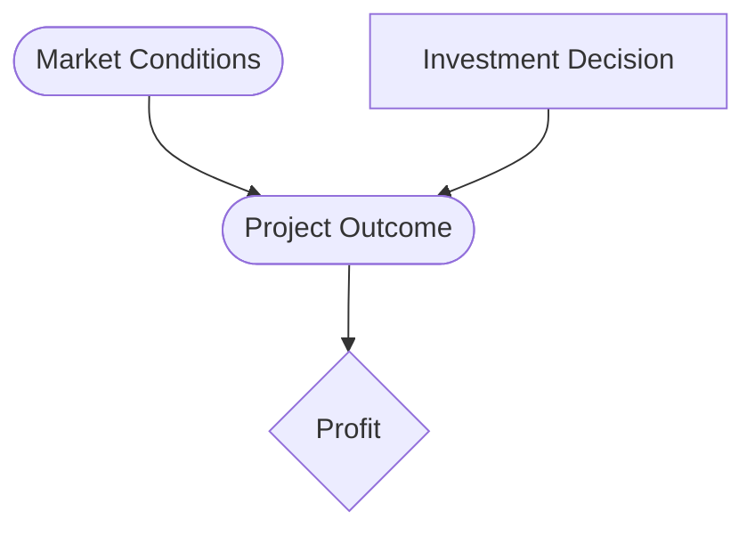
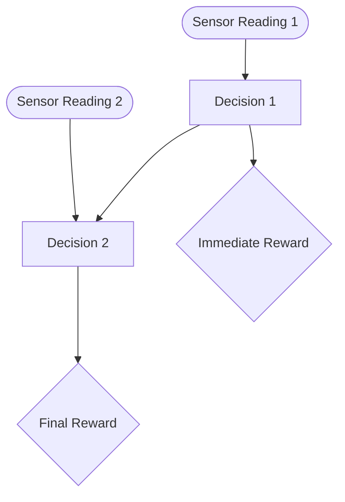

# Influence Diagrams and Limited Memory Influence Diagrams (LIMIDs)

## Definition

An **Influence Diagram (ID)** is an extension of a **Bayesian Network (BN)** that incorporates **decision nodes** and **utility nodes**, making it a powerful tool for decision analysis under uncertainty. Unlike Bayesian networks, which only model probabilistic relationships, influence diagrams explicitly represent the decision-making process to maximize a certain utility function.

### Components of an Influence Diagram

An influence diagram consists of three types of nodes:

1. **Chance Nodes (Circles):** Represent random variables with probabilistic dependencies.
2. **Decision Nodes (Rectangles):** Represent choices that a decision-maker can control.
3. **Utility Nodes (Diamonds):** Represent the **value or reward** associated with different outcomes.

Edges in the diagram indicate dependencies:

- **Arrows to chance nodes** represent probabilistic dependencies.
- **Arrows to decision nodes** indicate **available information** when making a decision.
- **Arrows to utility nodes** indicate which variables influence the outcome's utility.

### Example Influence Diagram: Investment Decision

Consider an **investment decision problem**, where a company decides whether to invest in a new project based on market conditions ($M$). The project outcome ($P$) is influenced by both the market conditions and the investment decision ($D$). The ultimate goal is to maximize expected profit ($U$):

The decision-making process follows: 
$P(M, D, P, U) = P(M) P(P | M, D) U(P)$ 
where:

- $P(M)$ is the prior probability of different market conditions.
- $P(P | M, D)$ represents the conditional probability of project success given the decision and market state.
- $U(P)$ assigns a utility value to different project outcomes.

To compute the **optimal decision rule** $D^*$ that maximizes expected utility: 
$D^* = \arg\max_D \sum_P P(P | M, D) U(P)$ 
This means that for each possible market condition $M$, the decision-maker selects $D$ to maximize the expected utility.

## Limited Memory Influence Diagrams (LIMIDs)

A **Limited Memory Influence Diagram (LIMID)** is a more flexible variation of an influence diagram that relaxes some of the structural constraints, allowing decisions to be made with partial information.

### Key Differences from Influence Diagrams

1. In standard influence diagrams, decisions follow a strict temporal sequence. LIMIDs allow decision making where past decisions may not be considered for future ones.
2. Not all past events are necessarily available when making a decision.
3. LIMIDs optimize decisions locally, thus reducing computational complexity

### Example LIMID: Multi-Stage Decision-Making

Consider a **robot navigation problem** where an autonomous robot must decide at two stages whether to take a shortcut ($D_1, D_2$) based on sensor readings ($S_1, S_2$). However, due to memory constraints, the second decision ($D_2$) does not have access to the first decision ($D_1$), only the second sensor reading ($S_2$):

The probability distribution for the system is: where:

- $P(S_1)$ and $P(S_2)$ are the probabilities of receiving specific sensor readings.
    
- $P(D_1 | S_1)$ and $P(D_2 | S_2)$ are decision rules based on available information.
    
- The reward functions $U(D_1)$ and $U(D_2)$ represent immediate and final rewards based on decisions taken.

### Computational Aspects of LIMIDs

Unlike full influence diagrams, where an **optimal policy** is computed by backward induction (solving a **single-stage decision problem** at each step), LIMIDs optimize **local decision rules** separately. The objective is to **maximize expected utility locally**:

Instead of solving the full decision problem, LIMIDs use **iterative message passing algorithms** such as **Single Policy Updating (SPU)**, which updates decision rules one at a time while keeping others fixed.

The key computational advantage is that LIMIDs do not require a **full policy computation**, significantly reducing the computational burden in large decision problems with imperfect memory.