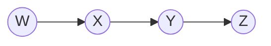

finding optimal decision (maximize utility function)
methods:
- variable elimination in bayesian network (doing it for one probablitiy)
- Shafer Shenoy (junction tree) algorithm (propagating it)

Markov chain (best case)
Variable elimination

$P(W, X, Y, Z) = P(W) P(X | W) P(Y | X) P(Z | Y)$
$P(Y)$?

$P(Y) = \sum_{w}\sum_{x}\sum_{z}P(w) P(x | w) P(Y | x) P()$
